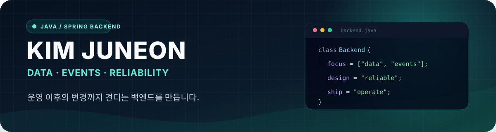
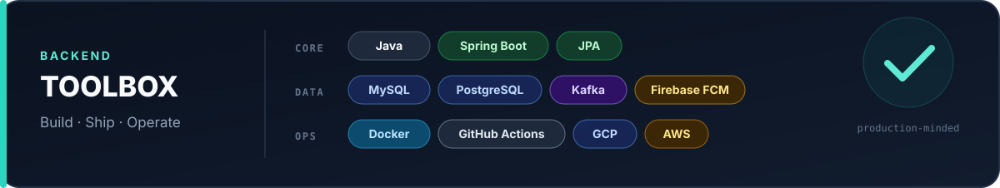
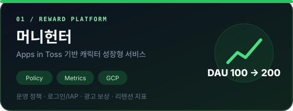
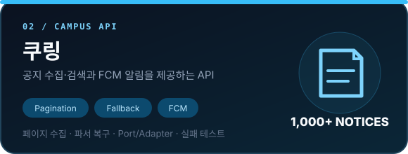

  

  
  
  
  

 

  

 

<h2 align="center">Selected Work</h2>

카드를 누르면 문제 · 해결 · 결과를 정리한 상세 페이지로 이동합니다.

  
  

  
  

 

<h2 align="center">GitHub Activity</h2>

  

  꾸준히 만들고, 운영하고, 배운 것을 기록합니다.

