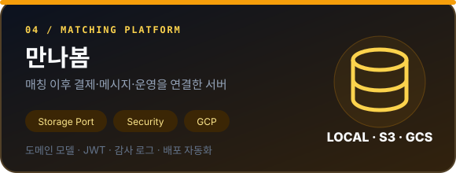

  

<strong><a href="https://github.com/mannabom/mannabomServer">저장소 ↗</a></strong> · <strong><a href="https://github.com/kimjuneon">← 프로필</a></strong>

| 구분 | 내용 |
| :---: | :--- |
| **Focus** | 도메인 모델, 파일 저장소 추상화, 인증·권한, 배포 |
| **Stack** | Java, Spring Boot, JPA, Docker, GCP |
| **Storage** | Local, S3, GCS Adapter |

<h2 align="center">핵심 기여</h2>

### 도메인과 데이터 모델

- 요청 출처를 프로필과 연애관으로 구분하도록 도메인 모델을 보완했습니다.
- 변경된 모델에 맞춰 DB 마이그레이션을 적용했습니다.

### 파일 저장소 추상화

- `FileStoragePort`를 중심으로 로컬·S3·GCS 저장소 Adapter를 분리했습니다.
- 저장소 변경이 핵심 비즈니스 로직에 영향을 주지 않도록 의존성 방향을 정리했습니다.

### 운영과 배포

- JWT 인증·권한·감사 로그와 관리자 운영 기능을 구현했습니다.
- GitHub Actions와 GCP 기반 배포 워크플로를 구성했습니다.

---

**[← Selected Work로 돌아가기](https://github.com/kimjuneon#selected-work)**

